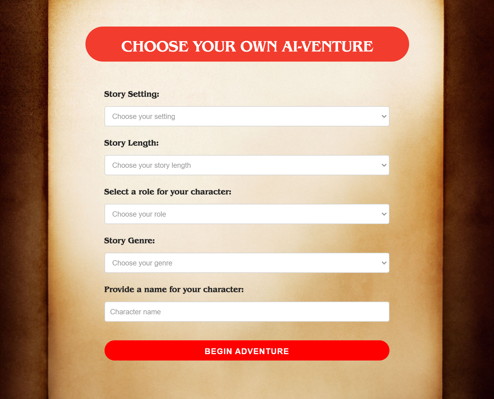
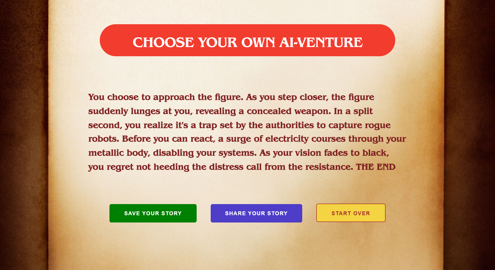

# Choose Your Own AI-venture 🌟

## Description 📖
Choose Your Own AI-venture is an interactive web-based storytelling application that integrates OpenAI's GPT and DALL-E models to create unique and dynamic stories based on user choices. Users can select their character's traits, the story's genre and setting, and guide the narrative through their decisions.

## Features 🚀
- **API Key Entry**: Users must enter an OpenAI API key to access the application.
- **User Preferences**: Users can customize their character and select the genre and setting for their adventure.
- **Dynamic Storytelling**: The story progresses based on user choices, offering a rich and varied narrative experience.
- **Image Generation**: Each story segment is accompanied by visually engaging images generated by DALL-E.
- **Save and Share Options**: Completed stories can be saved or shared, allowing users to revisit or showcase their unique adventures.

## Setup and Installation 💻
- **Local Setup**:
  1. Clone the repository to your local machine.
  2. Open the project in Visual Studio Code or your preferred IDE.
  3. Open the `index.html` file in a web browser to start using the application.
- **GitHub Pages**:
  - Alternatively, access the application directly through the provided GitHub Pages link.

## Website Preview 🌐
Below are some screenshots of the application in action:

Experience the thrill of your personalized adventure directly in your browser. The website offers an intuitive and user-friendly interface for seamless interaction with the story. Simply enter your preferences, and let your journey unfold!

## Usage Instructions 📝
1. Enter your OpenAI API key when prompted on the home page.
2. Fill in your character details and choose your desired story settings.
3. Start your adventure and make choices that shape the story.
4. Enjoy the dynamically generated text and images as your story unfolds.
5. Upon completing the story, choose to save, share, or start a new adventure.

## License 📜
This project is licensed under the MIT License. See the [LICENSE](LICENSE) file for more details.

## Acknowledgments 👏
- OpenAI for their GPT and DALL-E models.